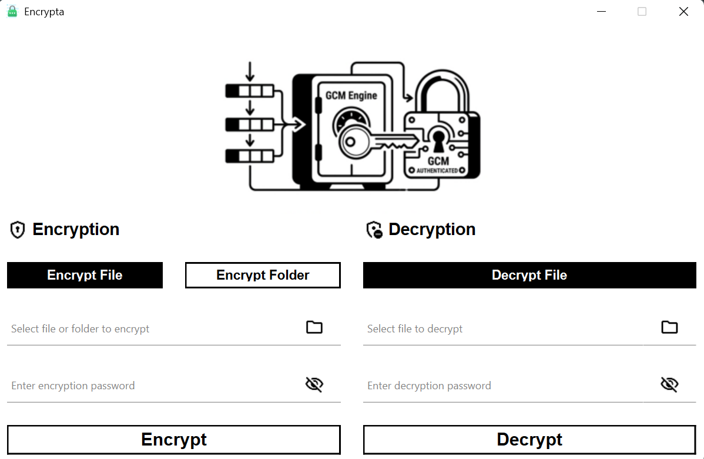

# Encrypta

A lightweight file encryption tool built with Python and PyQt6 using AES-GCM encryption.

---

## Features

- AES-GCM encryption (secure authenticated encryption)
- Simple GUI built with PyQt6
- Encrypt and decrypt files easily
- Custom `.enc` file format support
- Windows installer support via Inno Setup

---

## Screenshots

---

## How it works

- Select a file
- Enter password/key
- Encrypt → generates `.enc` file
- Decrypt using same password

---

## Installation

Download the installer from the releases section and run setup.

---

## Tech Stack

- Python 3
- PyQt6
- Cryptography (AES-GCM)
- Inno Setup (installer)

---

## Notes

- Keep your encryption key safe — lost key = lost data
- `.enc` files are only readable through Encrypta

---
